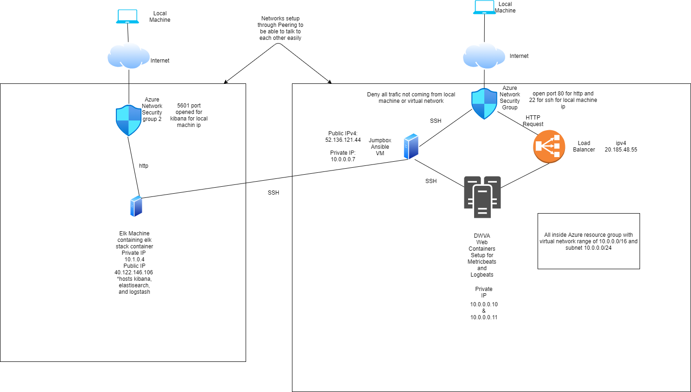
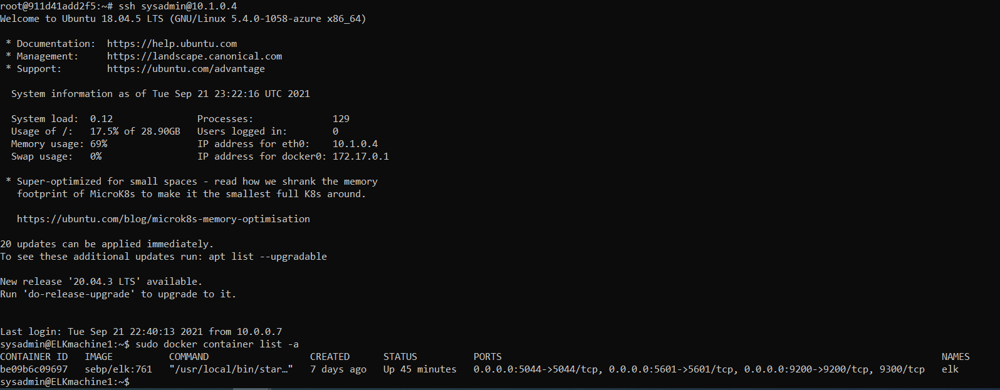

## Automated ELK Stack Deployment

The files in this repository were used to configure the network depicted below.

These files have been tested and used to generate a live ELK deployment on Azure. They can be used to either recreate the entire deployment pictured above. Alternatively, select portions of the yml file may be used to install only certain pieces of it, such as Filebeat.

ansible/pentest.yml, ansible/filebeat-playbook.yml and ansible/metricbeat-playbook.yml

Also included are filebeat and metric beat config files ansible/filebeat-config.yml and ansible/metricbeat-config.yml

This document contains the following details:
- Description of the Topology
- Access Policies
- ELK Configuration
  - Beats in Use
  - Machines Being Monitored
- How to Use the Ansible Build

### Description of the Topology

The main purpose of this network is to expose a load-balanced and monitored instance of DVWA, the D*mn Vulnerable Web Application.

Load balancing ensures that the application will be highly available, in addition to restricting access to the network.

Integrating an ELK server allows users to easily monitor the vulnerable VMs for changes to the file system and system performances.

The configuration details of each machine may be found below.
_Note: Use the [Markdown Table Generator](http://www.tablesgenerator.com/markdown_tables) to add/remove values from the table_.

| Name     | Function | IP Address | Operating System |
|----------|----------|------------|------------------|
| Jump Box | Gateway        | 10.0.0.7   | Linux            |
| Web01    |DVWA Host       | 10.0.0.10  | Linux            |
| Web02    |DVWA Host       | 10.0.0.11  | Linux            |
| Elk      |Monitor/Log DVWA| 10.1.0.    | Linux            |

### Access Policies

The machines on the internal network are not exposed to the public Internet. 

Only the Jump Box machine can accept connections from the Internet. Access to this machine is only allowed from the following IP addresses:
My personal public ip. 

Machines within the network can only be accessed by the jumpbox/other machines on the vnet.

A summary of the access policies in place can be found in the table below.

| Name     | Publicly Accessible | Allowed IP Addresses |
|----------|---------------------|----------------------|
| Jump Box | Yes to personal comp| personal ip public   |
| Web01    | No vnet only        |vnet                  |
| Web02    | No vnet only        |vnet                  |
| Elk      | yes to personal comp| personal ip public   |

### Elk Configuration

Ansible was used to automate configuration of the ELK machine. No configuration was performed manually, which is advantageous because it allows for consistent deployments that can be done en masse extremely easily accounting for scale.

The playbook implements the following tasks:
–Download/Install Docker
-Download/Install ELK
-Download/Install Filebeats and configuring to send files correctly to elk
-Download/Install Metricbeats and configuring to send files correctly to elk

The following screenshot displays the result of running `docker ps` after successfully configuring the ELK instance.

### Target Machines & Beats
This ELK server is configured to monitor the following machines:
- Web01 10.0.0.10 & Web02 10.0.0.11

We have installed the following Beats on these machines:
- Filebeat and metricbeat

These Beats allow us to collect the following information from each machine:
Filebeat collects file logs from linux allowing for tracking things such as users logon attempts.
Metricbeat collects system metrics allowing for tracking things such as CPU usage.

### Using the Playbook
In order to use the playbook, you will need to have an Ansible control node already configured. Assuming you have such a control node provisioned: 

SSH into the control node and follow the steps below:
- Copy the ansible.cfg file to /etc/ansible.
- Update the host file to include the hosts you’d like to manage in this case: private ips of the web servers and elk server 10.0.0.10, 10.0.0.11 and 10.1.0.4
- Run the playbook, and navigate to the associated servers to check that the installation worked as expected in this case: http://40.122.146.106:5601/app/kibana#/home/.

